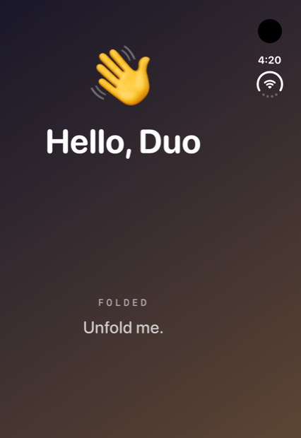
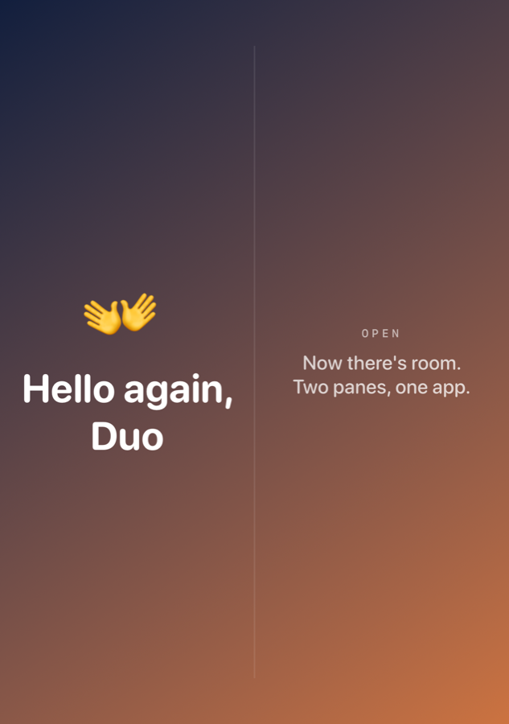

# Hello Duo

A Hello World for the iPhone Duo. One SwiftUI app, two layouts — folded it says hello, unfolded it says hello again, with room to spare.

| Folded | Open |
|---|---|
|  |  |

## The one interesting line

There is no `isFolded` API. You infer the pose from how much screen you have:

```swift
GeometryReader { geo in
    // Measure the whole screen, not just the safe area: the cover display is
    // ~466 pt wide, the inner display ~669 pt, so 560 sits between the two.
    let fullWidth = geo.size.width + geo.safeAreaInsets.leading + geo.safeAreaInsets.trailing
    let isOpen = fullWidth > 560

    DuoLayout(isOpen: isOpen)
        .animation(.spring(duration: 0.6), value: isOpen)
}
```

Two things worth knowing:

- **Add the safe area insets back.** `geo.size` excludes them. On the inner display that difference is big enough to push you under a naive threshold and make an unfolded phone look folded.
- **Put the `.animation` on the layout, not inside it.** The fold is a size change; animating the value that the size derives gives you one spring for the whole transition instead of a dozen competing ones.

Everything else is ordinary SwiftUI: an `HStack` of two panes when open, a `VStack` when folded.

## Run it

```bash
cd hello-duo
xcodegen generate
open HelloDuo.xcodeproj
```

Pick the **iPhone Duo** simulator and run. Fold and unfold it from **Device ▸ Fold** to watch the transition.

No `xcodegen`? The `.xcodeproj` is committed, so you can skip straight to `open`.

## Screenshotting the open pose without unfolding

Debug builds accept a `-renderOpen` launch argument that renders the open layout straight to `Documents/open.png` via `ImageRenderer`. Useful when the simulator won't unfold for you, which is how the image above was made:

```bash
xcrun simctl launch <device> com.mergisi.helloduo -renderOpen
cp "$(xcrun simctl get_app_container <device> com.mergisi.helloduo data)/Documents/open.png" .
```

## Requirements

iOS 18, Xcode 26. No dependencies.

## License

MIT — see [LICENSE](../LICENSE).
